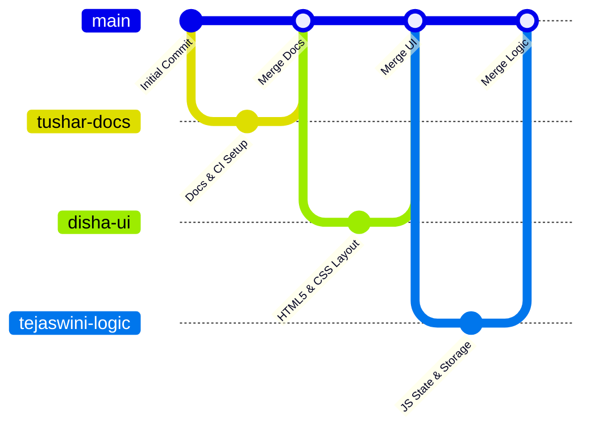

# 📦 Product Inventory Management System

[](https://github.com/tusharrr003/product-inventory-system/actions)


> A modern, responsive, web-based inventory management dashboard built with pure HTML5, vanilla CSS3 (Glassmorphism), and modular JavaScript. Features full CRUD lifecycle management, persistent client storage, instant search, dynamic multi-field sorting, low-stock threshold alerting, and real-time inventory valuation.

Developed as part of the **B.Tech Honors (Semester 4) TA3 Assessment** to demonstrate industry-standard Git collaboration workflows, CI/CD automated validation, and clean front-end architecture.

---

## 🖥️ Live Demo & Quick Start

The application runs entirely client-side without requiring Node.js, external package managers, or server installations.

### Option 1: Direct File Launch
1. Clone the repository:
   ```bash
   git clone https://github.com/tusharrr003/product-inventory-system.git
   cd product-inventory-system
   ```
2. Double-click [frontend/index.html](file:///d:/Tushar/Btech/honors/sem%204/TA3_project/inventory-system/frontend/index.html) or open it directly in any modern browser (Chrome, Edge, Firefox, Safari).

### Option 2: Local Static Server (Optional)
```bash
# Using Python 3
python -m http.server 8000 --directory frontend

# Or using VS Code Live Server extension: right-click frontend/index.html -> "Open with Live Server"
```

---

## ✨ Key Features

### 📋 Core Inventory Operations (CRUD)
- **➕ Add New Products**: Input product name, select category, specify price (₹), and set current stock quantity with strict client-side validation.
- **✏️ Real-Time Edit & Update**: Click "Edit" on any table row to automatically populate the input form, toggle edit mode, and update details seamlessly.
- **🗑️ Safe Deletion Modal**: Accessible confirmation dialog modal protects against accidental deletions.
- **💾 LocalStorage Sync**: Automatically synchronizes all state changes to browser `localStorage`, ensuring data persists across page reloads and browser sessions.

### 🔍 Search, Filter & Organization
- **Instant Search**: Real-time filtering by product name as you type.
- **Category Filter**: Dropdown filtering across major product sectors (*Electronics, Clothing, Food, Stationery, Furniture, Sports, Other*).
- **Multi-Field Sorting**: Sort by Product Name, Price, Quantity, or Category with toggleable Ascending / Descending order.
- **Clean Pagination**: Configurable items-per-page with pagination controls for smooth handling of larger catalogs.

### 📊 Real-Time Analytics & Alerts
- **Real-Time Valuation**: Dynamic header card computes total inventory monetary value (`₹`) across all active SKUs.
- **Low Stock Warning Banner**: Automatically flags products with stock quantity $\le 5$ units with warning banners and color-coded table badges (*In Stock*, *Low Stock*, *Out of Stock*).
- **Animated Toast Alerts**: Instant visual feedback for create, update, delete, and validation events.

---

## 🛠️ Technology Stack

| Layer | Technology | Details |
|---|---|---|
| **Structure** | HTML5 Semantic Markup | Accessible tags, dialog modals, forms, tables, ARIA attributes |
| **Styling** | Vanilla CSS3 | Custom design system, CSS variables, glassmorphic blur, responsive grid/flexbox |
| **Logic** | Vanilla JavaScript (ES6+) | Event-driven architecture, modular state handling, DOM manipulation |
| **Persistence** | Web Storage API | `localStorage` JSON serialization with fallback handling |
| **CI / CD** | GitHub Actions | Automated workflow for file structure, HTML integrity, and JS function validation |

---

## 🗂️ Project Directory Structure

```text
product-inventory-system/
│
├── .github/
│   └── workflows/
│       └── main.yml                  # GitHub Actions CI automated validation pipeline
│
├── docs/
│   └── GITHUB_WORKFLOW_GUIDE.md       # Team Git branching, PR, and GitHub setup guide
│
├── frontend/
│   ├── index.html                    # Semantic HTML5 dashboard markup
│   ├── style.css                     # Glassmorphic responsive styling & animations
│   └── script.js                     # Core business logic, CRUD & localStorage handler
│
└── README.md                         # Main repository documentation & overview
```

---

## 🌿 Team Collaboration & Branching Strategy

To demonstrate collaborative engineering best practices, each member maintained isolated feature branches before integrating through pull requests:



| Branch Name | Lead Member | Responsibilities | Key Deliverables |
|---|---|---|---|
| `main` | Production | Release branch | Merged, tested, production-ready code |
| `tushar-docs` | **Tushar** | Repository Lead, CI/CD, Documentation | GitHub setup, Actions CI (`main.yml`), `README.md`, `docs/` |
| `disha-ui` | **Disha** | Front-end Design & Structure | `index.html` structure, `style.css` glassmorphism styling |
| `tejaswini-logic` | **Tejaswini** *(collab. Janhavi)* | Business Logic & State | `script.js` CRUD, localStorage, search, sort, pagination |

> 📖 **Full Workflow Guide**: For step-by-step Git commands, PR procedures, and PAT token setup, see [docs/GITHUB_WORKFLOW_GUIDE.md](file:///d:/Tushar/Btech/honors/sem%204/TA3_project/inventory-system/docs/GITHUB_WORKFLOW_GUIDE.md).

---

## ⚙️ Automated Continuous Integration (CI)

The project includes an automated GitHub Actions pipeline configured in [`.github/workflows/main.yml`](file:///d:/Tushar/Btech/honors/sem%204/TA3_project/inventory-system/.github/workflows/main.yml). On every push or pull request to `main` and feature branches, the runner verifies:

1. **Required File Presence**: Ensures `index.html`, `style.css`, `script.js`, and `README.md` are present.
2. **HTML Structure Integrity**: Validates `<!DOCTYPE html>`, `<title>`, viewport meta tags, and correct CSS/JS link tags.
3. **Core JavaScript Validation**: Confirms mandatory methods (`deleteProduct`, `startEdit`, `renderTable`, `localStorage`) exist.
4. **Build Status**: Emits a build summary badge verifying project readiness.

---

## 👨‍💻 Team Members & Contributions

| Member | Academic Role | Individual Contribution |
|---|---|---|
| **Tushar** | Project Lead & DevOps | Git repository architecture, GitHub Actions CI workflow, project documentation, merge reviews, and guide documentation. |
| **Disha** | UI / UX Designer | Semantic HTML5 structure, modern glassmorphic CSS styling, responsive layout, table styling, and dialog UI. |
| **Tejaswini** | Core Logic Developer | Core JavaScript CRUD implementations, localStorage state persistence, search filter, sorting algorithms, pagination, and toast alerts. |

---

## 📸 Screenshots & UI Showcase

| Dashboard Overview | Add & Edit Form |
|:---:|:---:|
| *(Add screenshot of main dashboard here)* | *(Add screenshot of form and validation here)* |

| Search, Filter & Pagination | Delete Modal & Low-Stock Alert |
|:---:|:---:|
| *(Add screenshot of filtered table here)* | *(Add screenshot of confirmation modal and alert banner here)* |

---

## 📄 License & Academic Integrity

This project is created strictly for academic purposes as part of the **B.Tech Honors Semester 4 (TA3 Assessment)**. Open for educational demonstration and reference.
