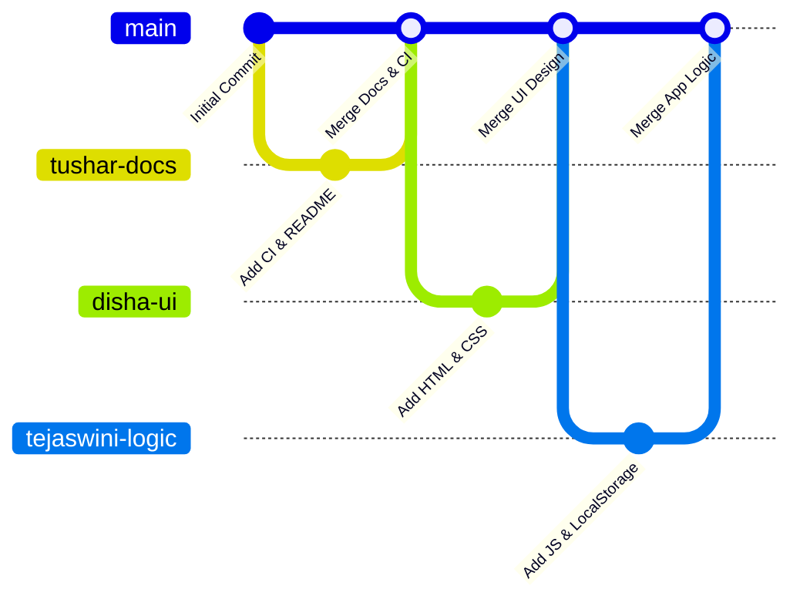

# 🚀 Complete Beginner GitHub Guide — Product Inventory System
### TA3 Academic Project — Step-by-Step Git & GitHub Collaboration Workflow

---

> [!IMPORTANT]
> **Team Role Distribution:**
> - 🔵 **Tushar (DevOps & Docs)** — Repository setup, CI workflow, documentation, branch integration, and PR reviews.
> - 🟡 **Disha (UI & Styling)** — HTML structure (`frontend/index.html`) and responsive glassmorphism CSS (`frontend/style.css`).
> - 🟢 **Tejaswini / Janhavi (Logic & Storage)** — JavaScript state management, CRUD, localStorage, search, filtering, and pagination (`frontend/script.js`).

---

## 📑 Table of Contents
1. [Git Branching Architecture](#-git-branching-architecture)
2. [Phase 1: Tushar's Initial Setup](#-phase-1-tushars-initial-setup-lead)
3. [Phase 2: Collaborator Setup (Disha & Tejaswini/Janhavi)](#-phase-2-collaborator-setup)
4. [Phase 3: Disha's Workflow (UI & Styling)](#-phase-3-dishas-workflow-ui--styling)
5. [Phase 4: Tejaswini's Workflow (Logic & Storage)](#-phase-4-tejaswinis-workflow-logic--storage)
6. [Phase 5: Pull Requests & Merging](#-phase-5-pull-requests--merging-tushar)
7. [Phase 6: CI/CD Pipeline Verification](#-phase-6-cicd-pipeline-verification)
8. [Troubleshooting & FAQs](#-troubleshooting--faqs)
9. [Report & Submission Checklist](#-report--submission-checklist)

---

## 🌿 Git Branching Architecture



| Branch Name | Primary Contributor | Purpose | Target Files |
|---|---|---|---|
| `main` | Team (Merged by Tushar) | Production-ready stable release | All project files |
| `tushar-docs` | Tushar | Setup, CI pipeline, documentation | `README.md`, `.github/workflows/main.yml`, `docs/*` |
| `disha-ui` | Disha | Semantic markup & Glassmorphic styling | `frontend/index.html`, `frontend/style.css` |
| `tejaswini-logic` | Tejaswini / Janhavi | Data modeling, CRUD, filters, storage | `frontend/script.js` |

---

## 🔵 Phase 1: Tushar's Initial Setup (Lead)

### 1. Create GitHub Repository
1. Log in to [GitHub](https://github.com).
2. Click **New Repository** (or the **+** icon in the top right).
3. Set **Repository Name**: `product-inventory-system`
4. Set Visibility: **Public**
5. Leave "Add a README file" unchecked (or check it if initializing empty; we have a custom README).
6. Click **Create repository**.

### 2. Add Collaborators
1. In the repository, navigate to **Settings** > **Collaborators**.
2. Click **Add people**.
3. Enter Disha's and Tejaswini's GitHub usernames or email addresses.
4. Send invitations. Ensure each team member opens their email or goes to GitHub to **Accept Invitation**.

### 3. Generate Personal Access Token (PAT)
GitHub requires Personal Access Tokens instead of account passwords for command-line authentication:
1. Click your profile avatar (top right) → **Settings**.
2. Scroll to the bottom and click **Developer settings**.
3. Select **Personal access tokens** → **Tokens (classic)**.
4. Click **Generate new token (classic)**.
5. Set Note: `inventory-dev-token`, Expiration: `30 days` (or preferred duration).
6. Check the **`repo`** scope (Full control of private and public repositories).
7. Click **Generate token** and copy it immediately.

### 4. Push Baseline & Docs Branch
Open **Git Bash** or terminal in `d:/Tushar/Btech/honors/sem 4/TA3_project/inventory-system`:

```bash
# Initialize git if not already initialized
git init

# Connect local repo to GitHub
git remote add origin https://github.com/YOUR_USERNAME/product-inventory-system.git

# Verify remote
git remote -v

# Create and switch to documentation branch
git checkout -b tushar-docs

# Stage and commit documentation and CI
git add README.md .github/ docs/
git commit -m "docs: add comprehensive project README, workflow guide, and CI pipeline"

# Push branch to GitHub
git push -u origin tushar-docs
```

---

## 👥 Phase 2: Collaborator Setup

Both Disha and Tejaswini/Janhavi must complete this one-time setup:

### 1. Install Git
- Download Git from [git-scm.com/downloads](https://git-scm.com/downloads).
- Follow the installer defaults and restart your terminal/command prompt.

### 2. Configure Identity
```bash
git config --global user.name "Your Name"
git config --global user.email "your.email@example.com"
```

### 3. Clone the Repository
```bash
git clone https://github.com/TUSHAR_USERNAME/product-inventory-system.git
cd product-inventory-system
```

---

## 🟡 Phase 3: Disha's Workflow (UI & Styling)

Disha handles the visual presentation and semantic structure:

### 1. Create Feature Branch
```bash
git checkout -b disha-ui
```

### 2. Work on Files
- `frontend/index.html` — Header stats, product entry form, filter controls, product table, delete modal.
- `frontend/style.css` — CSS design tokens, glassmorphism cards, responsive grid, animations.

### 3. Commit and Push Changes
```bash
# Check status
git status

# Stage UI files
git add frontend/index.html frontend/style.css

# Commit with descriptive message
git commit -m "feat(ui): implement modern glassmorphic dashboard layout and responsive controls"

# Push to remote branch
git push -u origin disha-ui
```

---

## 🟢 Phase 4: Tejaswini's Workflow (Logic & Storage)

Tejaswini handles client-side state and application logic:

### 1. Create Feature Branch
```bash
git checkout -b tejaswini-logic
```

### 2. Work on Files
- `frontend/script.js` — Core CRUD methods, localStorage read/write, search filtering, low stock alerts, pagination.

### 3. Commit and Push Changes
```bash
# Check status
git status

# Stage logic files
git add frontend/script.js

# Commit with descriptive message
git commit -m "feat(logic): implement CRUD operations, localStorage sync, search, filter and pagination"

# Push to remote branch
git push -u origin tejaswini-logic
```

---

## 🔄 Phase 5: Pull Requests & Merging (Tushar)

To demonstrate proper team workflow for academic evaluation:

### 1. Open Pull Request on GitHub
1. Navigate to the repository on GitHub.
2. Under the **Pull requests** tab, click **New pull request**.
3. Set **base: `main`** and **compare: `disha-ui`** (then repeat for `tejaswini-logic` and `tushar-docs`).
4. Add clear PR title and summary:
   - **Title**: `PR: Merge UI Design and Layout (Disha)`
   - **Description**: Added responsive HTML5 structure, glassmorphism UI, and modal dialogs.
5. Click **Create pull request**.

### 2. Review and Merge
1. Review the file changes in the **Files changed** tab.
2. Ensure automated GitHub Actions CI checks pass (green checkmark).
3. Click **Merge pull request** → **Confirm merge**.
4. Repeat for all collaborator branches.

### 3. Synchronize Local `main`
On Tushar's local system:
```bash
git checkout main
git pull origin main
```

---

## ⚙️ Phase 6: CI/CD Pipeline Verification

The project includes an automated GitHub Actions CI workflow in `.github/workflows/main.yml`.

### Pipeline Stages:
1. **Repository Checkout**: Clones the repo in an Ubuntu runner.
2. **File Existence Validation**: Verifies all required artifacts exist:
   - `frontend/index.html`
   - `frontend/style.css`
   - `frontend/script.js`
   - `README.md`
3. **HTML Structure Integrity**:
   - Validates `<!DOCTYPE html>`, `<title>`, viewport meta tag, linked stylesheet and script.
4. **JavaScript Function Check**:
   - Confirms essential methods are present (`deleteProduct`, `startEdit`, `renderTable`, `localStorage`).

### How to Check Status:
1. Go to the **Actions** tab on your GitHub repository.
2. Click the latest workflow run (e.g., `Inventory CI`).
3. Expand **Validate Project Files** to inspect build logs.
4. All checks should show green checkmarks (✅).

---

## 🛠️ Troubleshooting & FAQs

### Q1: `fatal: remote origin already exists`
```bash
git remote set-url origin https://github.com/YOUR_USERNAME/product-inventory-system.git
```

### Q2: Authentication failed during `git push`
GitHub discontinued password authentication in 2021. You must use a **Personal Access Token (PAT)** as your password. Refer to [Phase 1: Step 3](#3-generate-personal-access-token-pat).

### Q3: `error: failed to push some refs to...`
Someone pushed changes to the remote branch that you do not have locally:
```bash
git pull --rebase origin <branch-name>
git push origin <branch-name>
```

### Q4: Merge conflicts during PR
If GitHub indicates conflicts between branches:
1. Locally checkout your feature branch: `git checkout <branch-name>`
2. Pull latest main: `git pull origin main`
3. Open the conflicted files in VS Code, select incoming or current change.
4. Save, stage (`git add .`), commit (`git commit -m "fix: resolve merge conflicts"`), and push.

---

## 📸 Report & Submission Checklist

Prepare these screenshots for the TA3 assessment project report:

- [ ] **GitHub Repository Home**: Showing folder tree, README display, and member activity.
- [ ] **Branches Overview**: Showing `main`, `tushar-docs`, `disha-ui`, and `tejaswini-logic`.
- [ ] **Pull Requests Tab**: Showing closed/merged pull requests with discussions/notes.
- [ ] **GitHub Actions (CI/CD)**: Showing green checkmark passing badge for `Validate Project Files`.
- [ ] **Running Application**: Live UI in browser showing:
  - Header statistics (Total Products, Total Value, Low Stock Alert)
  - Add/Edit product form
  - Filtered table with stock badges and action buttons
  - Interactive delete modal and toast alerts
